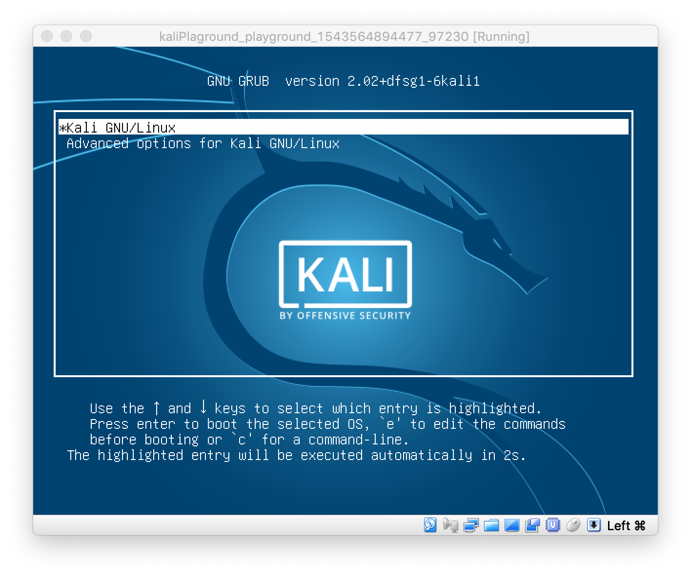
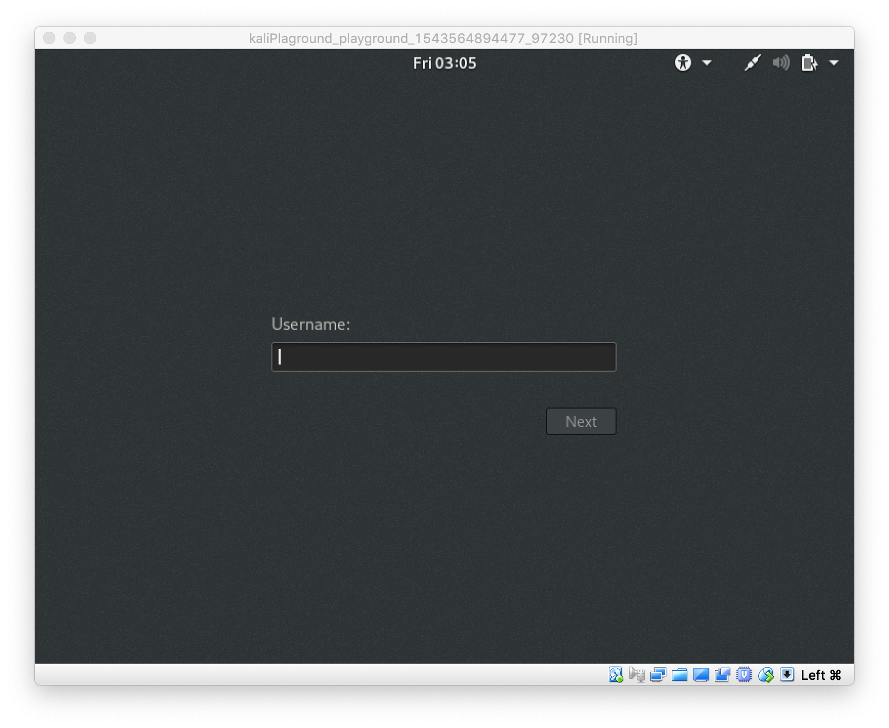
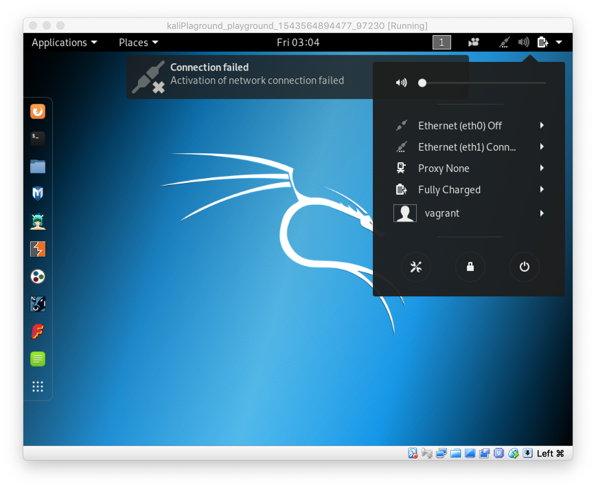
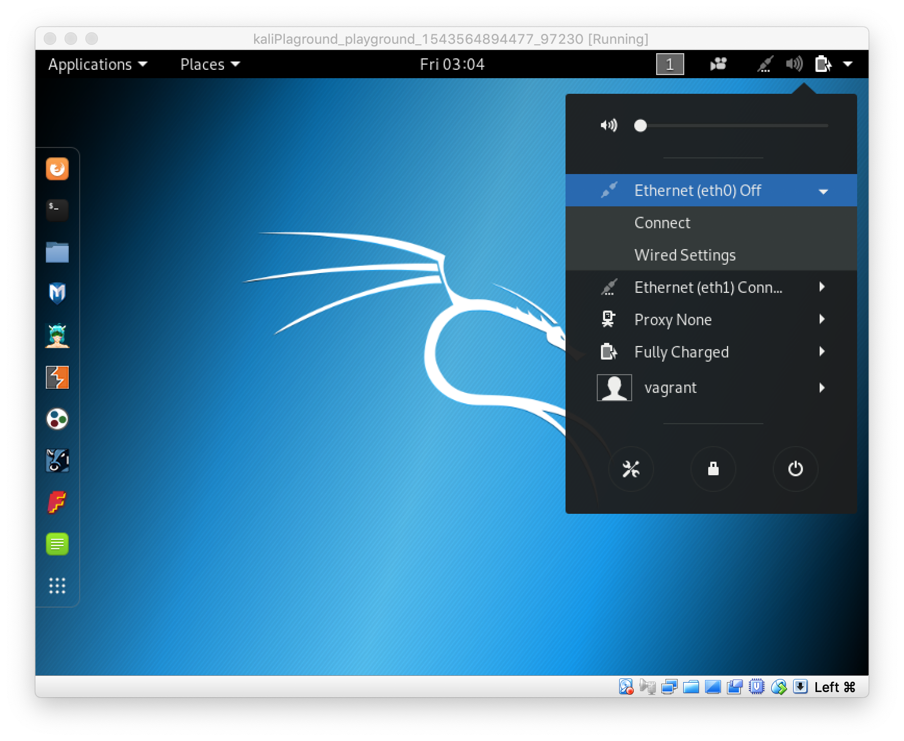
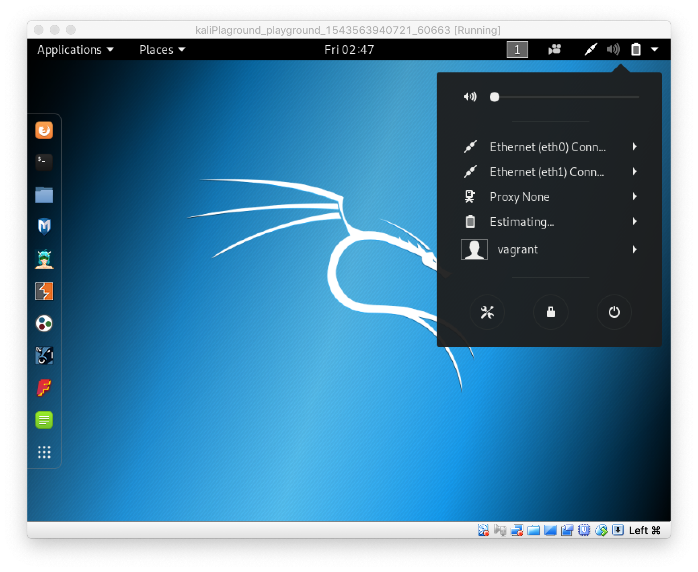
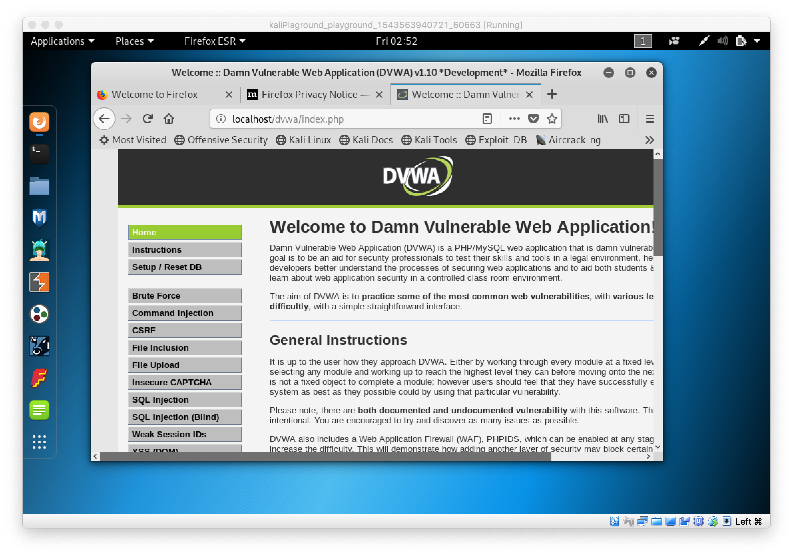

# kaliPlayground

[Reference]
http://noperfectsecurity.tistory.com/m/56

## Requirements
Host OS : MacOS

[Download Virtualbox](https://www.virtualbox.org/wiki/Downloads)

[Download Vagrant](https://www.vagrantup.com/downloads.html)

[Download Python 2.7.x](https://www.python.org/downloads/mac-osx/)

## Installation
git clone 후 python 가상 실행 환경 세팅
```
$ git clone https://github.com/redtree0/kaliPlayground.git
$ cd kaliPlayground
$ pip install virtualenv
$ virtualenv -p python2.7 citos_env
$ source citos_env/bin/activate
```

python 패키지 설치(ansible etc) 및 ansible roles 설치
```
$ pip install -r requirements.txt
$ ansible-galaxy install -r requirements.yml -p roles/
```

vm 생성
```
$ vagrant up
```
일정 시간 지나면 다음 VM 화면이 뜬다.

여기서 "Enter"혹은 몇초 기다리면 로그인으로 넘어간다.

vm 로그인을 해주어야 다음단계가 진행이 된다. 계정은 다음과 같다.
```
id : vagrant
password : vagrant
```
로그인 하면 하단 화면 처럼 가끔 ethernet connection이 안될 때가 있다.

우측 상단 메뉴 클릭 하면 ethernet dropdown 메뉴가 나온다.

eth0에 connect버튼을 누르면 외부 네트워크와 nat로 연결된 것이다.


playbook.dvwa.setup.yml 파일에 8, 9번 라인에 다음과 같이 있을 것이다.
```
    - recaptcha_public_key: "YOUR_PUBLIC_KEY"
    - recaptcha_private_key: "YOUR_PRIVATE_KEY"
```
reCAPTCHA 키등록 과정 수행 후, YOUR_PUBLIC_KEY, YOUR_PRIVATE_KEY 대신 발급 받은 키를 넣는다. 그 후 make dvwa 명령 실행한다.

```
(env) $ make dvwa
ansible-playbook playbook.dvwa.setup.yml -i inventory.ini

PLAY [master] ***************************************************************************************************

TASK [Gathering Facts] ******************************************************************************************
ok: [192.168.99.20]

TASK [php7.2-gd install] ****************************************************************************************
changed: [192.168.99.20]

TASK [Download DVWA in /tmp] ************************************************************************************
changed: [192.168.99.20]

TASK [Mode 755 for directory and files] *************************************************************************
changed: [192.168.99.20]

TASK [Mode 777 in dvwa/hackable] ********************************************************************************
changed: [192.168.99.20]

TASK [Mode 777 in dvwa/external/phpids/0.6/lib/IDS/tmp/phpids_log.txt] ******************************************
changed: [192.168.99.20]

TASK [copy from config.inc.php.dist to config.inc.php] **********************************************************
changed: [192.168.99.20]

TASK [/etc/php/7.2/apache2/php.ini allow_url_include=Off => On] *************************************************
changed: [192.168.99.20]

TASK [/etc/php/7.2/cli/php.ini allow_url_include=Off => On] *****************************************************
changed: [192.168.99.20]

TASK [config.inc.php] *******************************************************************************************
changed: [192.168.99.20]

TASK [recaptcha_public_key] *************************************************************************************
changed: [192.168.99.20]

TASK [recaptcha_private_key] ************************************************************************************
changed: [192.168.99.20]

TASK [copy from /tmp/dvwa to /var/www/html/dvwa] ****************************************************************
changed: [192.168.99.20]

TASK [Mysqld restart] *******************************************************************************************
changed: [192.168.99.20]

TASK [create database] ******************************************************************************************
changed: [192.168.99.20]

TASK [setup mysql dvwa] *****************************************************************************************
changed: [192.168.99.20]

TASK [Apache2 restart] ******************************************************************************************
changed: [192.168.99.20]

PLAY RECAP ******************************************************************************************************
192.168.99.20              : ok=17   changed=16   unreachable=0    failed=0
```

firefox 브라우저 키고 http://localhost/dvwa/index.php
접속해서 되면 성공이다.


## clean
vm 삭제
```
$ vagrant destroy
```
